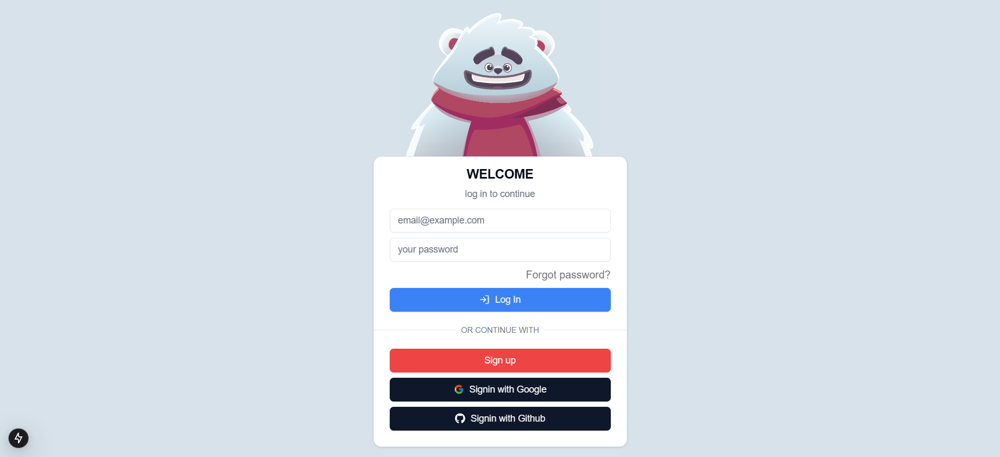

# NEXT-FIREBASE-AUTH 

## Sobre

Este projeto implementa a autenticação no Next.js utilizando o NextAuth.js v5, integrando provedores do Google e GitHub com o Firebase. Ele oferece um fluxo de login seguro e eficiente, aproveitando a flexibilidade do NextAuth para gerenciar sessões e autenticação de usuários.

## Tecnologias

## Índice

- [Planner](#planner-)
  - [Sobre](#sobre)
  - [Tecnologias](#tecnologias)
  - [Índice](#índice)
  - [Fotos](#fotos)
  - [Instalação](#instalação)
  - [Contatos](#contatos)
- 

## Fotos

## Instalação

- **Instalação**
  - npm install
- **Rodando o app**
  - npm run dev

## Contatos

#
